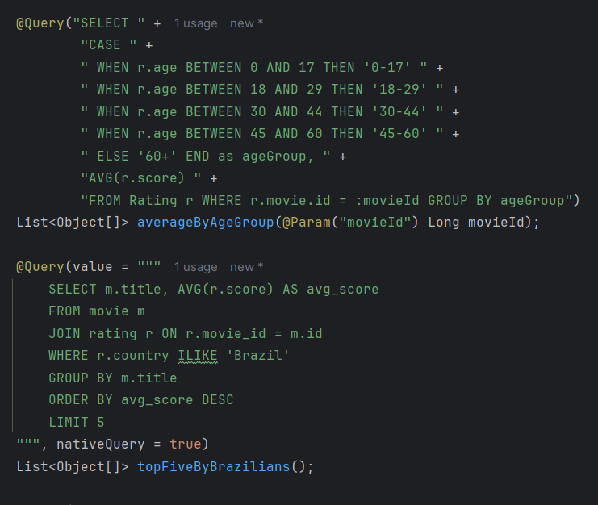
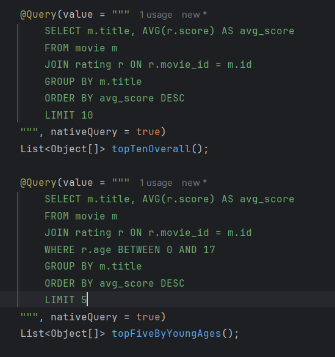
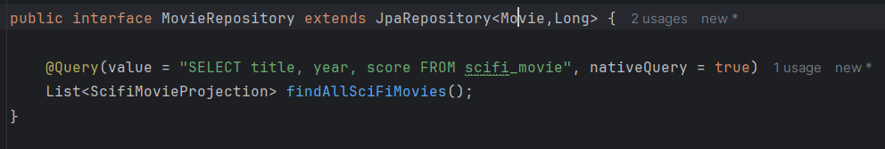
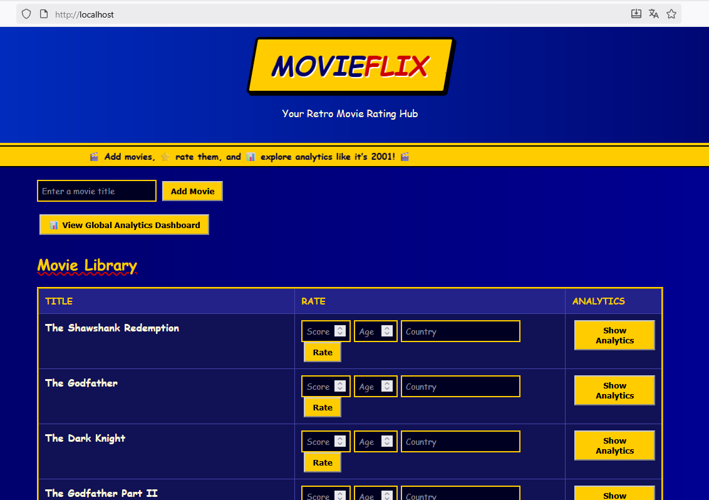
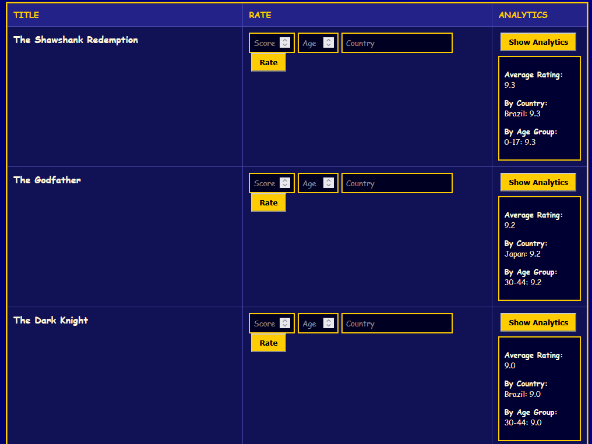
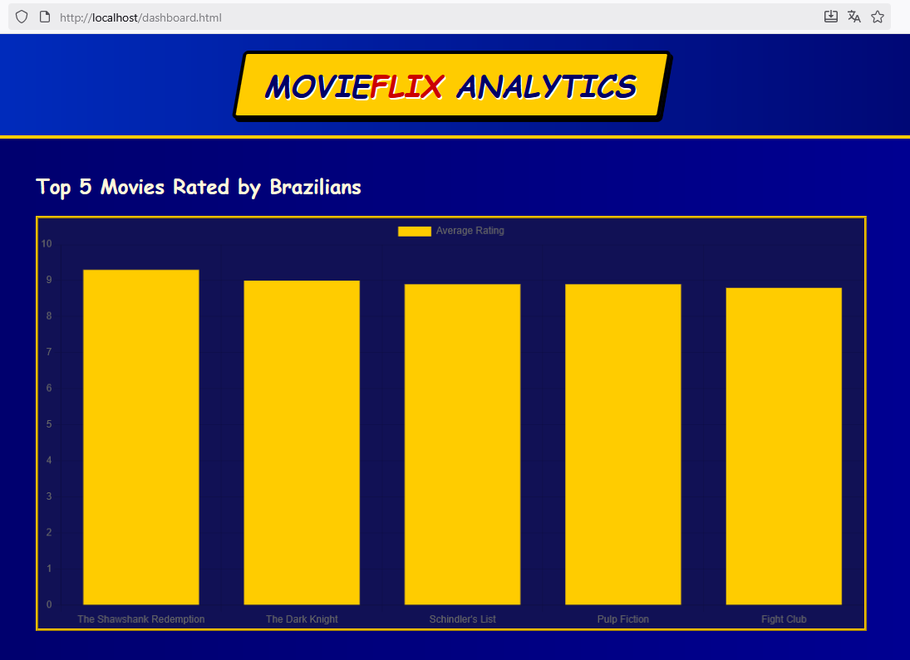
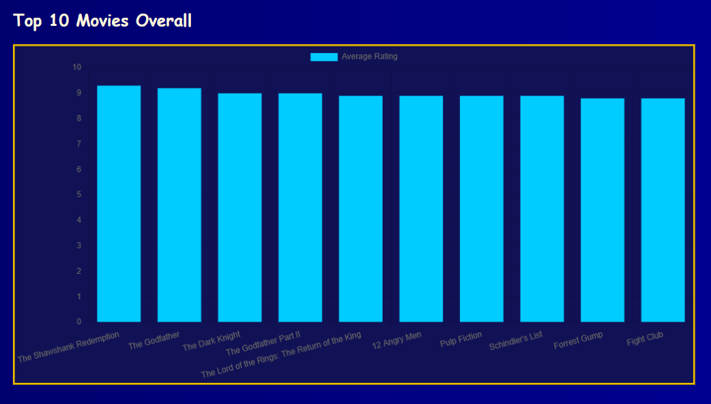
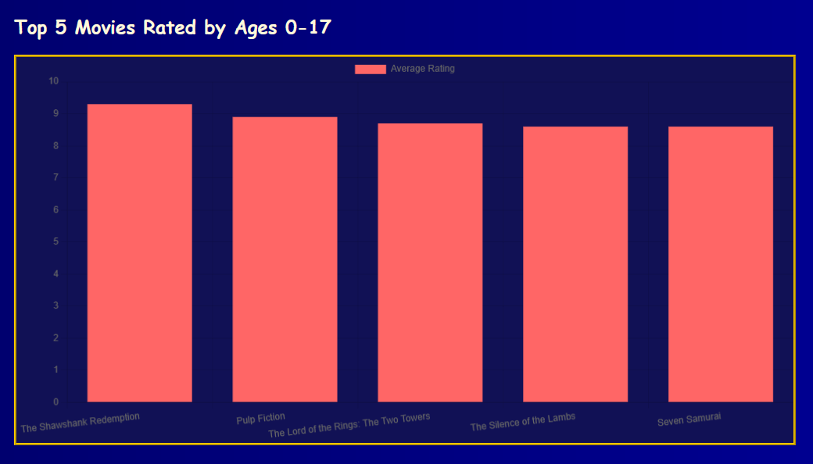
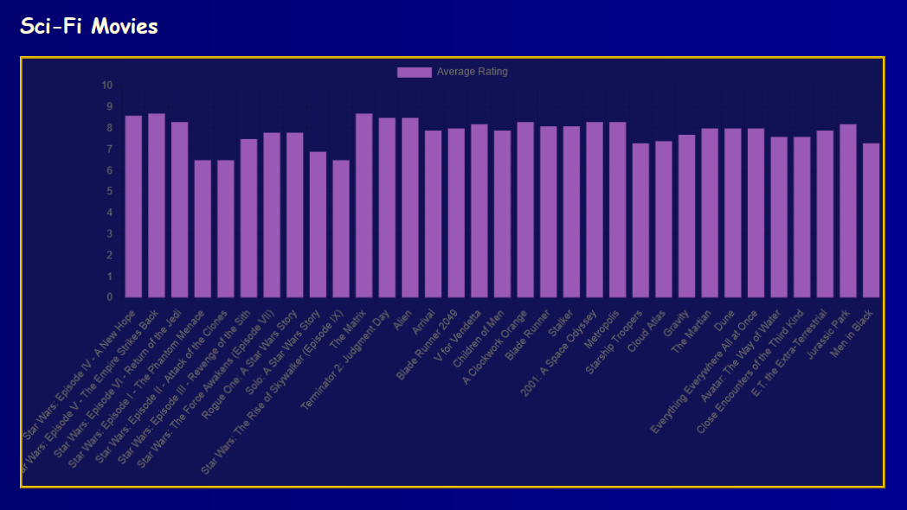

Neste projeto criei uma aplicação básica para dar notas a filmes e verificar algumas estatísticas usando um visual retrô
estilo anos 90s e 00s.
O intuito dele é utilizar os conhecimentos adquiridos em aula sobre Docker, github actions e análise de dados.
Eu separei a aplicação em 3 partes: Backend (movieflix-project), Frontend (movieflix-frontend) e Dados (movieflix-data).

No backend usei Java + spring boot por já estar acostumado com essa stack. Basicamente no backend temos os endpoints
(arquivo MovieController.java) em que recebemos requisições do front e repassamos para a nossa camada de serviço (MovieService.java). Nela fazemos uma checagem de algumas informações e chamamos os repositories (MovieRepository e RatingRepository), onde enfim fazemos chamadas para o banco de dados. O MovieRepository tem além dos métodos básicos fornecidos pelo JpaRepository, a query que busca no data mart de Sci-fi todos os filmes (esse data mart foi criado pelo script em Python). Já o RatingRepository conta com algumas queries extras para a página inicial e para os dashboards da aplicação (top 5 filmes melhores ranqueados por brasileiros, top 10 geral e top 5 por pessoas com até 17 anos).

Vale destacar que para facilitar a questão das notas eu separei elas em uma entidade à parte para conseguir calcular a média das notas de cada filme conforme mais usuários adicionassem notas ao filme.

O Frontend eu pedi pro chat gpt gerar um visual estilo Blockbuster que remetesse aos anos 90 e 00 pra deixar ele mais bonitinho. Mas como o front não é o foco, não vou falar muito dele. Mas basicamente temos duas páginas. O index.html onde o usuário tem as informações de todos os filmes e pode adicionar um filme à lista e dar nota para ele. E o dashboard.html (clicando em view global analytics dashboard) que mostra algumas estatísticas para o usuário em formato de gráfico de barras.

Por fim a parte de dados. Criei um arquivo etl em python baseado nos que fizemos durante as aulas para inserir no banco de dados (PostgreSQL) as informações do arquivo raw_movies.csv. Esse arquivo tem título, ano de lançamento, gênero e nota no IMDB de diversos filmes. Entretanto, algumas entradas desse arquivo foram propositalmente deixadas em branco (exemplo: filme sem o ano de lançamento e/ou nota) para imitar casos reais de dados faltando. Nesse caso, o script em python atribui um valor padrão para as colunas vazias antes de subir no banco de dados. Também nesse mesmo arquivo faço uma query para buscar todos os filmes de Sci-fi para deixá-los em uma tabela separada para uma fácil busca quando necessário.

Falando um pouco do docker. Para facilitar minha vida, optei por usar docker-compose para subir todas as aplicações juntas sem ter que ficar subindo uma por uma. Por conta disso, tive um problema na hora de fazer testes no github actions e implementar um CI/CD, já que minha aplicação backend espera que o banco de dados já esteja rodando (e não pare depois de rodar os testes dele) e o frontend depende do backend (embora esse consiga funcionar mesmo sem o backend rodando). Mas resolvi usando o mesmo conceito que usei localmente, fazendo o docker compose build + fazendo o docker compose up para rodar as aplicações fazer os testes e por fim fazendo o docker compose down para parar os conteineres rodando.
